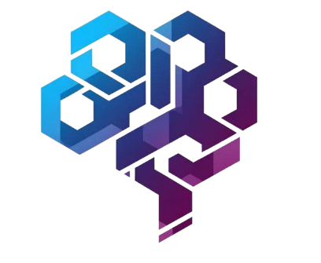
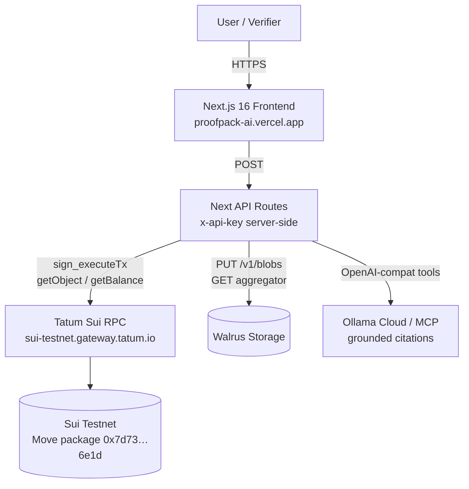
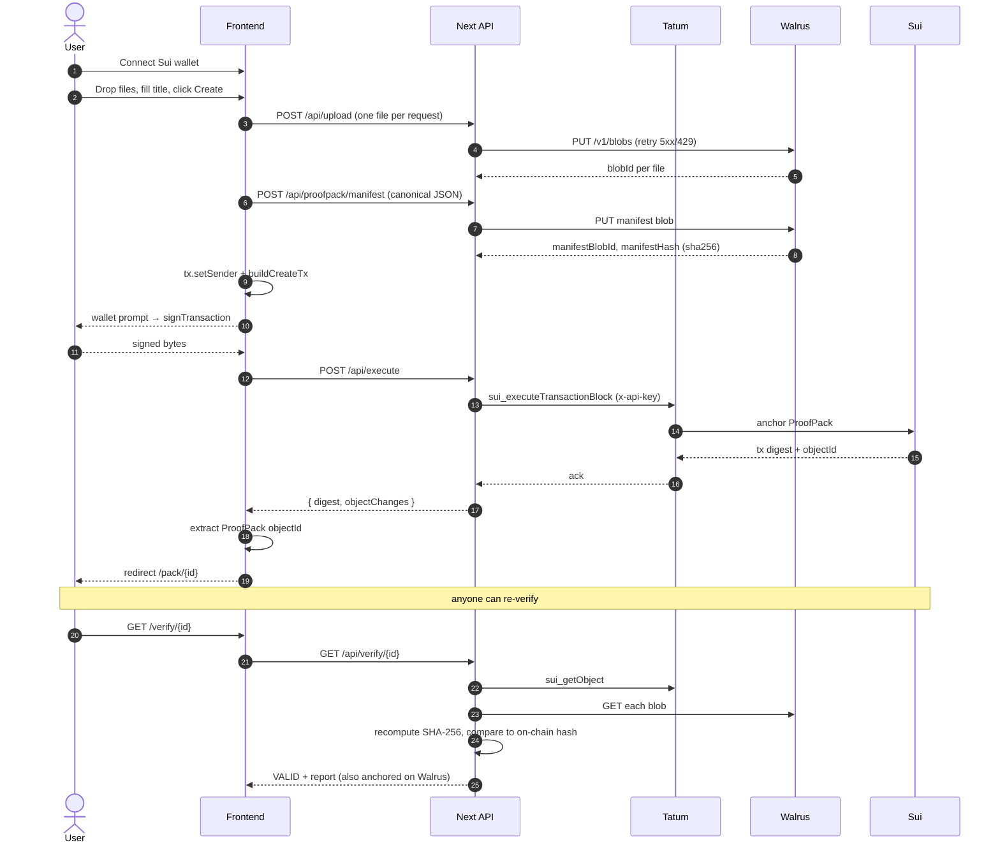

<div align="center">



# ProofPack AI

### Verifiable AI Data Room on **Sui** + **Walrus** + **Tatum**

Upload files. Anchor the hash on Sui. Let the AI answer — and cite cryptographic proof for every claim.

[**🚀 Live demo →**](https://proofpack-ai.vercel.app/) &nbsp;·&nbsp; [**🧾 Sample pack →**](https://proofpack-ai.vercel.app/verify/0xa3f9c701ca4dc50da787b48168d8339ea7d2aefc7d10b0c3a8cec06bfcf6c95f) &nbsp;·&nbsp; [**📦 Move contract →**](https://suiscan.xyz/testnet/object/0x7d73e2b962e9d769bc20bd61fe87999e6b987ef7761bfde11f8b337bc7406e1d) &nbsp;·&nbsp; [**🎥 Demo video (todo)**]()


</div>

---

## ✨ Why ProofPack AI

Sharing important files today relies on **trust** — trust the sender, trust the host, trust the chatbot summary. ProofPack AI removes all three:

| Layer | Without ProofPack | With ProofPack |
|---|---|---|
| Storage | Trust Drive/S3 not to silently edit | Walrus blob — content-addressed, decentralized |
| Authorship | Trust an email signature | Sui Move object — owner address + timestamp on-chain |
| AI answers | Hallucinations confidently | Refusal-by-default; every claim cites `blobId` + `sha256` |

Built for **Tatum × Build on Sui with Walrus** (May 23 – June 6, 2026).

---

## 🏗️ Architecture



Every byte is on Walrus. Every hash is on Sui. Every AI claim carries a cryptographic citation — or refuses to answer.

---

## 🟢 Live state

| Resource | Value |
|---|---|
| **Frontend** | https://proofpack-ai.vercel.app/ |
| **Sui network** | `testnet` |
| **Move package** | [`0x7d73e2b962e9d769bc20bd61fe87999e6b987ef7761bfde11f8b337bc7406e1d`](https://suiscan.xyz/testnet/object/0x7d73e2b962e9d769bc20bd61fe87999e6b987ef7761bfde11f8b337bc7406e1d) |
| **Shared Registry** | [`0x39e89ddfa9f29e1285b5eab4c80e24bbcaa5a242c582fd21e240673e0a099e50`](https://suiscan.xyz/testnet/object/0x39e89ddfa9f29e1285b5eab4c80e24bbcaa5a242c582fd21e240673e0a099e50) |
| **Demo pack** | [`0xa3f9c701ca4dc50da787b48168d8339ea7d2aefc7d10b0c3a8cec06bfcf6c95f`](https://proofpack-ai.vercel.app/verify/0xa3f9c701ca4dc50da787b48168d8339ea7d2aefc7d10b0c3a8cec06bfcf6c95f) (VALID ✅) |
| **RPC gateway** | https://sui-testnet.gateway.tatum.io |
| **Walrus testnet** | https://aggregator.walrus-testnet.walrus.space |

---

## 🎯 Hackathon compliance

| Req | Status |
|---|---|
| **R1** Tatum API key | ✅ Active. Server-side `TATUM_API_KEY`, attached as `x-api-key` on every Sui RPC + Walrus Storage call |
| **R2** Tatum Sui RPC nodes | ✅ All reads + writes route through `sui-testnet.gateway.tatum.io`. Browser→server proxy for execute (bypasses gateway CORS, also attributes usage) |
| **R3** Walrus storage **meaningfully** | ✅ Core substrate. File bytes + canonical manifest JSON + verification reports → Walrus blobs. Remove Walrus = product dies |
| **R4** Sui Mainnet preferred / Testnet ok | ✅ Deployed to testnet; Mainnet = one-command flip (same Move, no contract changes) |
| **R5** MCP optional, encouraged | ✅ `lib/ai/mcp.ts` wires Tatum Sui RPC as OpenAI-compatible tool calls (`sui_getObject`, `sui_getBalance`, `sui_getChainIdentifier`) — functional MCP equivalent without stdio subprocess |
| **R6** Team 1–3 members | ✅ Solo build |
| **R7** GitHub repo + 2–3 min video | ✅ Repo + ⏳ video |

### Judging alignment

| Criterion | Weight | How we score |
|---|---|---|
| Walrus + Tatum Integration | 30% | Both are **load-bearing**, not decorative. Tatum proxies every RPC (CORS workaround + usage attribution). Walrus holds every byte (files, manifest, verify report). |
| Technical Quality | 30% | Strict TypeScript. 9/9 Move tests pass. Server/client secret separation. Retry + abort wrappers around free-tier RPC bursts. End-to-end seed → verify proven on testnet. |
| Creativity | 20% | **Grounded AI** — refusal-by-default, blobId-cited citations. AI cannot fabricate references; out-of-pack questions get `"Not found in this ProofPack."` |
| Presentation | 20% | This README · animated landing page · 27-route Vercel build · branded `WalletPanel`, `JsonView` syntax viewer, `PackCard` 3D tilt. |

---

## 🧱 Repository layout

```
tatum-walrus/
├── README.md                ← you are here
├── DEPLOY.md                ← Vercel deploy guide
├── Requirement.md           ← hackathon brief (verbatim)
├── .env.example
├── frontend/                ← Next.js 16 + Move-aware client
│   ├── app/
│   │   ├── (app)/           ← authenticated app routes (Header layout)
│   │   │   ├── dashboard/
│   │   │   ├── pack/[id]/
│   │   │   ├── pack/new/
│   │   │   └── verify/[id]/
│   │   ├── api/
│   │   │   ├── balance/     ← server proxy with x-api-key
│   │   │   ├── chat/[id]/   ← grounded AI
│   │   │   ├── execute/     ← signed-tx submit (bypass Tatum CORS)
│   │   │   ├── owned/       ← list ProofPacks for an address
│   │   │   ├── proofpack/   ← getObject + manifest fetch
│   │   │   ├── upload/      ← multipart → Walrus
│   │   │   └── verify/[id]/ ← SHA-256 recompute + report
│   │   ├── page.tsx         ← landing (GSAP)
│   │   └── layout.tsx
│   ├── components/
│   │   ├── PackCard.tsx     ← framer-motion 3D tilt + shimmer
│   │   ├── JsonView.tsx     ← VS Code-ish syntax highlighting
│   │   ├── WalletPanel.tsx  ← avatar + balance + copy + disconnect
│   │   ├── WalletGate.tsx   ← gates routes behind wallet
│   │   └── landing/         ← Hero, FAQ, StackMarquee, visuals
│   ├── lib/
│   │   ├── ai/              ← claude · openai · ollama · mcp + grounding filter
│   │   ├── sui/             ← Tatum-wrapped SuiClient + tx builder + parsers
│   │   ├── tatum/           ← API client + Storage API
│   │   ├── walrus/          ← upload (retry/timeout) + fetch (IPFS fallback)
│   │   ├── hash/            ← Web Crypto SHA-256 + canonical JSON
│   │   ├── retry.ts         ← exponential backoff on 429
│   │   ├── manifest.ts      ← canonical manifest builder
│   │   ├── env.ts           ← typed env loader
│   │   └── types.ts
│   ├── scripts/
│   │   └── seed-demo.ts     ← end-to-end seeding (Walrus + Sui)
│   └── vercel.json
└── sc/                      ← Sui Move package "proofpack"
    ├── Move.toml
    ├── Move.lock
    ├── Published.toml       ← chain-id + packageId committed
    ├── sources/
    │   └── proofpack.move   ← Registry, ProofPack, events, access rules
    └── tests/
        └── proofpack_tests.move ← 9 tests, 100% pass
```

---

## ⚙️ Smart contract

Package `proofpack` (Move 2024 edition):

```move
public struct Registry has key { id: UID, count: u64 }

public struct ProofPack has key, store {
    id: UID,
    owner: address,
    manifest_blob_id: String,
    manifest_hash: vector<u8>,        // 32 bytes SHA-256
    version: u64,
    visibility: u8,                   // 0 private | 1 unlisted | 2 public
    created_at_ms: u64,
    previous_version: Option<ID>,
}
```

Entry points: `create`, `update_version`, `set_visibility`, `transfer_ownership`.
Events: `ProofPackCreated`, `ProofPackUpdated`, `VisibilityChanged`, `OwnershipTransferred`.

Access enforced by `assert!(pack.owner == ctx.sender(), ENotOwner)` on every mutation.

```bash
cd sc
sui move test          # 9 passed; 0 failed
sui client publish --gas-budget 200000000
```

---

## 🔄 End-to-end flow



---

## 🔐 Security model

- **API key isolation** — `TATUM_API_KEY`, `OLLAMA_KEY` never cross to the browser. All gateway/storage calls go server-side.
- **No server-held wallet keys** — every write tx is signed in the browser wallet via `useSignTransaction`. Server only **submits** the already-signed bytes.
- **Hash recompute in the user's browser** — the verifier never trusts the manifest provided by us; it always SHA-256s the bytes itself.
- **AI grounding filter** — server drops any citation whose `blobId` is not in the manifest. If nothing valid remains, the answer is substituted with `"Not found in this ProofPack."` before reaching the browser.
- **No private keys in repo** — `.env.local` gitignored. `git log -p | grep -i KEY` returns nothing.

---

## 🤖 AI providers

| Provider | Wiring | Notes |
|---|---|---|
| `none` | (default) | Returns "AI provider not configured" — app still works |
| `ollama` | OpenAI-compat `/v1/chat/completions` against Ollama Cloud | Default in production; uses `gpt-oss:120b-cloud` |
| `claude` | Anthropic Messages API | swap `AI_API_KEY` |
| `openai` | OpenAI Chat Completions | swap `AI_API_KEY` |
| `mcp` | Tatum Sui RPC as OpenAI **tools** | `sui_getObject` / `sui_getBalance` / `sui_getChainIdentifier` — live on-chain lookup mid-answer |

System prompt + JSON schema enforced. Grounding filter rejects fabricated references.

---

## 🛠️ Local development

### Prerequisites
- Node.js 20+
- Sui CLI 1.64+
- A Sui wallet browser extension (Sui Wallet, Suiet, Phantom-Sui)
- Free Tatum API key from [dashboard.tatum.io](https://dashboard.tatum.io)

### Quick start

```bash
git clone https://github.com/EzraNahumury/tatum-walrus.git
cd tatum-walrus/frontend
cp .env.local.example .env.local      # fill in TATUM_API_KEY at minimum
npm install
npm run dev                            # http://localhost:3000
```

### Move contract

```bash
cd sc
sui move build
sui move test                          # 9/9
sui client publish --gas-budget 200000000
# copy packageId + Registry object id into frontend/.env.local
```

### Seed a demo pack

```bash
cd frontend
# .env.local must include SEED_PRIVATE_KEY (suiprivkey…)
npm run seed:demo
# → prints objectId + verifier URL
```

### Environment variables

```env
# Server-only
TATUM_API_KEY=
SEED_PRIVATE_KEY=                          # seed script only

# Public
NEXT_PUBLIC_SUI_NETWORK=testnet
NEXT_PUBLIC_TATUM_SUI_RPC_URL=https://sui-testnet.gateway.tatum.io

# Walrus
WALRUS_UPLOAD_MODE=walrus_publisher        # or tatum_storage_api
WALRUS_PUBLISHER_URL=https://publisher.walrus-testnet.walrus.space
WALRUS_AGGREGATOR_URL=https://aggregator.walrus-testnet.walrus.space
NEXT_PUBLIC_WALRUS_AGGREGATOR_URL=https://aggregator.walrus-testnet.walrus.space
WALRUS_DEFAULT_EPOCHS=30

# Sui Move (deployed)
NEXT_PUBLIC_PACKAGE_ID=0x7d73e2b962e9d769bc20bd61fe87999e6b987ef7761bfde11f8b337bc7406e1d
NEXT_PUBLIC_PROOFPACK_REGISTRY_ID=0x39e89ddfa9f29e1285b5eab4c80e24bbcaa5a242c582fd21e240673e0a099e50

# AI (optional)
AI_PROVIDER=ollama                         # claude | openai | mcp | none
OLLAMA_HOST=https://ollama.com
OLLAMA_KEY=
OLLAMA_MODEL=gpt-oss:120b-cloud
```

---

## 🚢 Deployment

Production is on **Vercel**: https://proofpack-ai.vercel.app/

See [`DEPLOY.md`](DEPLOY.md) for one-click GitHub import or `npx vercel --prod` CLI flow + the exact env-vars block to paste into the Vercel dashboard.

---

## 🎬 Demo script (2–3 min)

1. **Hook (0:00–0:20)** — "This is a tamper-proof evidence pack. Three files. The AI can answer questions about them and proves every claim."
2. **Create (0:20–0:50)** — `/pack/new` → drag 4 files from `testing/pack-grant/` → wallet sign → land on detail page with on-chain anchor + 4 blobIds.
3. **Verify (0:50–1:30)** — copy verifier URL into incognito → page renders **VALID** ✅, every file row shows expected vs actual SHA-256.
4. **AI grounded (1:30–2:20)** — "What's the projected ARR?" → `$420,000` cited from `revenue-proof.json`. "What's the CEO's birthday?" → `Not found in this ProofPack.`
5. **Tamper (2:20–2:50)** — point verifier at a random objectId → red **INVALID** with byte diff.

Test fixtures live in [`testing/`](testing/) (gitignored). Three ready-to-paste packs: `pack-grant`, `pack-dao`, `pack-diploma`.

---

## 📜 License

MIT. Built for the Tatum × Walrus hackathon. PRs welcome.

---

<div align="center">

Powered by [Sui](https://sui.io/) · [Walrus](https://www.walrus.xyz/) · [Tatum](https://tatum.io/chain/sui)

</div>
