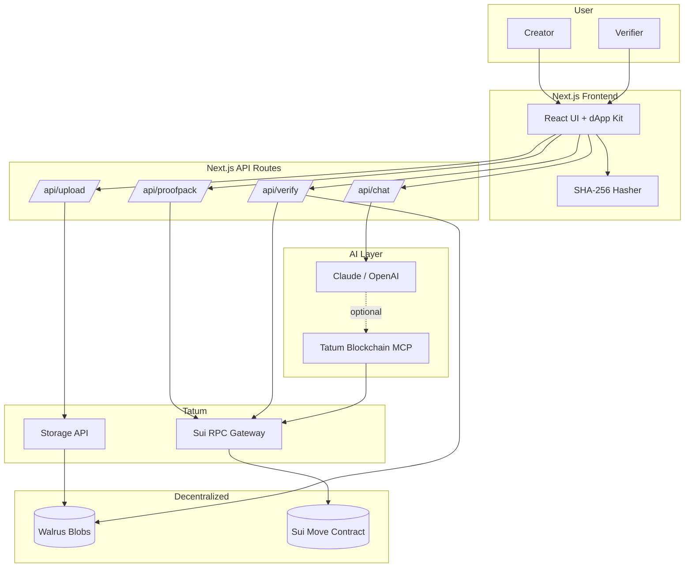
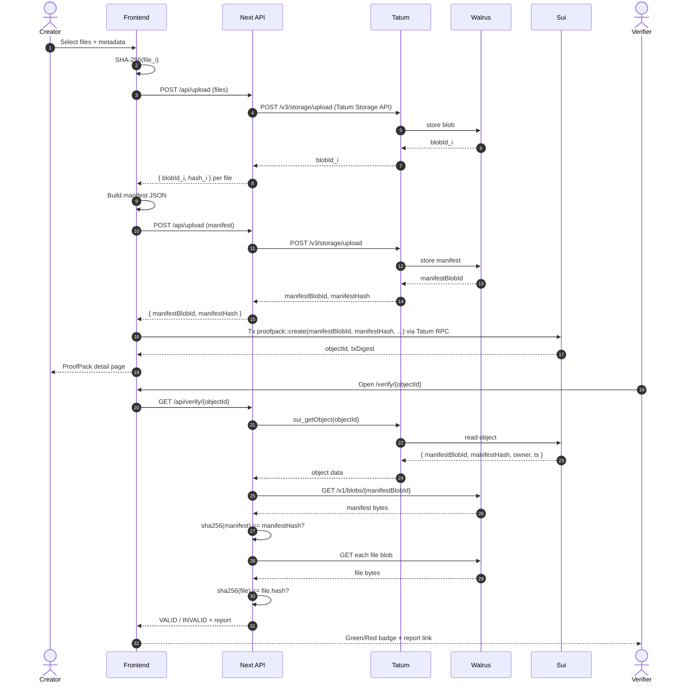

# ProofPack AI

> **Verifiable AI Data Room on Sui + Walrus**
> Decentralized, hash-anchored, AI-explainable evidence packs — every answer comes with a proof.

---

## 1. Project Title

**ProofPack AI** — A Verifiable AI Data Room built on Sui, powered by Walrus decentralized storage and Tatum Sui RPC.

## 2. One-liner

Upload any file, get a tamper-proof "ProofPack" anchored on Sui with content stored on Walrus, then let an AI assistant answer questions about it — and every answer cites cryptographic proof (blobId, hash, objectId).

## 3. Hackathon Fit

Built for **Tatum x Build on Sui with Walrus** (May 23 – June 6, 2026).

- **Walrus**: every file, manifest, and snapshot is stored as a Walrus blob. Walrus is the storage substrate, not an add-on.
- **Tatum**: every Sui read/write goes through Tatum Sui RPC endpoints (`sui-mainnet.gateway.tatum.io` / `sui-testnet.gateway.tatum.io`). Tatum Storage API is the primary path for Walrus uploads.
- **Sui**: a Move smart contract creates `ProofPack` objects that bind ownership, blobId, manifest hash, and timestamp on-chain.
- **MCP / AI**: an AI assistant answers questions about a pack and is wired to optionally call the Tatum Blockchain MCP server for on-chain lookups — keeping answers grounded in verifiable evidence.

The submission targets the **top 5 placement** plus both **Best Walrus Integration** and **Best Use of Tatum Tools** side prizes.

---

## 4. Requirement.md Summary

The local `Requirement.md` is the verbatim hackathon brief. Extracted requirements and our implementation plan:

| # | Requirement (from Requirement.md) | Implementation Plan | Status |
|---|-----------------------------------|----------------------|--------|
| R1 | Use a Tatum API key (free via dashboard.tatum.io) | `TATUM_API_KEY` env var, server-side only, used by `lib/tatum/client.ts` for RPC + Storage API | Planned |
| R2 | Use Tatum's Sui RPC nodes | `lib/sui/client.ts` instantiates `SuiClient` with `NEXT_PUBLIC_TATUM_SUI_RPC_URL` | Planned |
| R3 | Integrate Walrus storage meaningfully (not an add-on) | All evidence files + JSON manifest + verification report stored as Walrus blobs; blobId is the source of truth referenced on-chain | Planned |
| R4 | Build on Sui Mainnet (preferred) or Testnet/Devnet | Testnet for hackathon dev; Move package + frontend ready for Mainnet flip via env switch | Planned (Testnet first, Mainnet stretch) |
| R5 | MCP optional but encouraged for AI features | AI assistant has a pluggable `mcp` provider; Tatum Blockchain MCP wired as optional tool for on-chain lookups | Planned (nice-to-have) |
| R6 | Team size 1–3 members | Single-builder submission | OK |
| R7 | Submit GitHub repo + 2–3 min demo video | Repo public on GitHub; recorded demo follows the script in §22 | Planned |
| R8 | Judging — Walrus + Tatum Integration 30% | See §5 Winning Strategy + §14, §15 | Planned |
| R9 | Judging — Technical Quality 30% | TypeScript, typed contracts, Move tests, integration tests for upload/anchor/verify | Planned |
| R10 | Judging — Creativity 20% | "AI assistant that cites proof" angle — novel combination of verifiable storage + grounded LLM | Planned |
| R11 | Judging — Presentation 20% | This README + Mermaid diagrams + 2–3 min demo video + public verifier page | Planned |
| R12 | Bonus — share on X/LinkedIn tagging @Tatum_io, @WalrusFoundation, @SuiNetwork | Post on launch with demo link | Planned |

---

## 5. Winning Strategy

How ProofPack AI maps to the judging rubric:

### Walrus & Tatum Integration — 30%
- Walrus is **not optional, not decorative**. Removing Walrus breaks the product. Every file payload + manifest + verification report lives on Walrus.
- Tatum is the **only** gateway to Sui in this app. Every `sui_getObject`, `sui_executeTransactionBlock`, and event subscription routes through Tatum RPC.
- Tatum Storage API is the **primary** Walrus upload path (`WALRUS_UPLOAD_MODE=tatum_storage_api`). Direct Walrus HTTP publisher is kept as a documented fallback only.
- Concrete artifacts judges can verify: blobId on Walrus aggregator, Sui object on Suiscan, recomputed SHA-256 matches on-chain hash.

### Technical Quality — 30%
- Strict TypeScript, Move contract with unit tests, deterministic hashing (SHA-256 over canonical bytes), idempotent API routes, structured error types.
- Clear separation: `lib/tatum`, `lib/walrus`, `lib/sui`, `lib/hash`, `lib/ai`. No tangled side-effects in React components.
- E2E happy-path test: upload → walrus → manifest → sui anchor → verifier passes.

### Creativity — 20%
- **Grounded AI**: assistant cannot answer without citing blobId + hash. Refuses if data not in pack. This makes the LLM verifiable — a fresh angle in Sui/Walrus space.
- Use cases: legal evidence, grant reporting, hackathon proof, DAO transparency, insurance claims, academic certificates.

### Presentation — 20%
- This README is investor-grade.
- Mermaid diagrams render directly on GitHub.
- 2–3 min demo follows a tight, easy-to-follow script.
- Public verifier page (`/verify/[id]`) is shareable and self-explanatory.

---

## 6. Problem

Today, sharing "proof" of anything — a grant report, a pitch deck, an audit, a claim — relies on trust in the sender and in centralized storage (Dropbox, S3, Google Drive). The recipient cannot independently verify that the file has not been altered, when it was created, or who owns it. AI tools make this worse: a chatbot summarizing a PDF can hallucinate, and there is no link back to the source bytes.

## 7. Solution

ProofPack AI gives any user a one-click way to:

1. Bundle one or more files into a **ProofPack**.
2. Store the bytes on **Walrus** (decentralized, content-addressed, durable).
3. Anchor an immutable manifest on **Sui** (ownership, hash, timestamp, version).
4. Get a **public verifier link** that anyone can open to independently re-verify hashes against Walrus + Sui.
5. Ask an **AI assistant** about the pack — every answer cites blobId, hash, and Sui objectId, so the reader can audit the AI.

## 8. Core User Story

> As a startup founder applying for a grant, I want to submit a tamper-proof evidence pack (pitch deck, revenue proof, roadmap, founder attestation) so that the grant committee can independently verify nothing has been altered since submission and ask an AI summarizer that cites exact source files.

---

## 9. Full Product Flow

### 9.1 Creator Flow
1. User connects a Sui wallet via Sui dApp Kit.
2. User creates a new ProofPack (title, description, optional tags, visibility).
3. User uploads one or more files via drag-and-drop.
4. Client (or server, for >5 MB) computes SHA-256 of each file.
5. App uploads each file to Walrus via Tatum Storage API; receives a `blobId` per file.
6. App builds a manifest JSON (see §18) containing the full file list, hashes, blobIds, sizes, content types, owner address, and timestamps.
7. App uploads the manifest JSON to Walrus → `manifestBlobId`, `manifestHash`.
8. App submits a Sui transaction calling `proofpack::create` with `(manifestBlobId, manifestHash, version, visibility)`; user signs in wallet.
9. App displays the ProofPack detail page with `objectId`, all blobIds, hashes, explorer + Walrus aggregator links.

### 9.2 Verifier Flow
1. Verifier opens `https://<app>/verify/<objectId>` (or pastes a Sui object ID into the verify page).
2. App fetches the Sui object via Tatum RPC (`sui_getObject`).
3. App fetches the manifest blob from Walrus using `manifestBlobId`.
4. App recomputes SHA-256 of the manifest bytes → must equal `manifestHash` on-chain.
5. For each file in the manifest, app fetches the blob from Walrus and recomputes its SHA-256 → must equal the per-file hash inside the manifest.
6. App renders a green **VALID** badge (or **INVALID** with the exact diff) and a downloadable verification report JSON (also pushed to Walrus for share-ability).

### 9.3 AI Assistant Flow
1. User opens a ProofPack and starts a chat.
2. App extracts text from manifest + text-like files (.md, .txt, .json, .csv).
3. User asks a question.
4. AI receives a strict system prompt: *"Only answer using the supplied ProofPack context. For every claim, cite `[file=<name> blobId=<id> hash=<sha>]`. If the answer is not in the context, reply `Not found in this ProofPack`."*
5. AI returns answer + structured `references[]` array.
6. UI renders citations as clickable chips that open the Walrus blob and Sui object.

### 9.4 Admin / Demo Flow
1. `pnpm seed:demo` creates a sample "Startup Due Diligence Pack" with four fixture files (pitch deck summary, revenue proof, product roadmap, founder attestation), pushes them to Walrus + Sui Testnet, and prints the verifier URL.
2. Demo wallet address is shown in the dashboard footer for the judges.

---

## 10. Architecture

### 10.1 Frontend
Next.js 14 (App Router) + TypeScript + Tailwind + Sui dApp Kit. Pages: `/`, `/dashboard`, `/pack/new`, `/pack/[id]`, `/verify/[id]`, `/chat/[id]`.

### 10.2 Backend / API
Next.js API routes under `src/app/api/*`. Stateless — no database. All persistent state lives on Sui (metadata) and Walrus (bytes). A thin Redis-or-in-memory cache for verifier responses is the only optional component.

### 10.3 Sui Move Contract
Package `proofpack` with one object type `ProofPack` and a shared `Registry`. See §13.

### 10.4 Tatum RPC
`@mysten/sui` `SuiClient` is constructed with `url: NEXT_PUBLIC_TATUM_SUI_RPC_URL`. All reads and the dry-run + execute pipeline for tx go through Tatum. API key is passed via the `x-api-key` header through a server-side fetch wrapper.

### 10.5 Walrus Storage
- **Primary path**: Tatum Storage API (`POST /v3/storage/upload`) — keeps the integration single-vendor and judge-friendly.
- **Fallback**: Walrus publisher HTTP (`PUT /v1/blobs`) for local dev.
- Reads use the Walrus aggregator (`GET /v1/blobs/<blobId>`) directly — no Tatum dependency on read.

### 10.6 AI / MCP Layer
`lib/ai/provider.ts` defines an `AIProvider` interface. Implementations: `ClaudeProvider`, `OpenAIProvider`, `MCPProvider`. The MCP provider connects to `tatumio/blockchain-mcp` and exposes `sui_getObject`, `sui_getEvents` to the model so it can do live on-chain lookups inside an answer.

---

## 11. Data Flow Diagram



---

## 12. Sequence Diagram — Upload, Anchor, Verify



---

## 13. Sui Smart Contract Design

Package: `proofpack` (Move).

### 13.1 Objects

```move
public struct ProofPack has key, store {
    id: UID,
    owner: address,
    manifest_blob_id: String,
    manifest_hash: vector<u8>,   // 32 bytes, SHA-256
    version: u64,
    visibility: u8,              // 0 = private, 1 = unlisted, 2 = public
    created_at_ms: u64,
    previous_version: Option<ID>,
}

public struct Registry has key {
    id: UID,
    count: u64,
}
```

### 13.2 Entry Functions

```move
public entry fun create(
    registry: &mut Registry,
    manifest_blob_id: String,
    manifest_hash: vector<u8>,
    visibility: u8,
    clock: &Clock,
    ctx: &mut TxContext,
);

public entry fun update_version(
    pack: ProofPack,
    new_manifest_blob_id: String,
    new_manifest_hash: vector<u8>,
    clock: &Clock,
    ctx: &mut TxContext,
);

public entry fun transfer_ownership(
    pack: ProofPack,
    new_owner: address,
    ctx: &mut TxContext,
);

public entry fun set_visibility(
    pack: &mut ProofPack,
    visibility: u8,
    ctx: &mut TxContext,
);
```

### 13.3 Events

```move
public struct ProofPackCreated has copy, drop {
    pack_id: ID,
    owner: address,
    manifest_blob_id: String,
    manifest_hash: vector<u8>,
    version: u64,
    timestamp_ms: u64,
}

public struct ProofPackUpdated has copy, drop {
    pack_id: ID,
    previous_pack_id: ID,
    new_manifest_blob_id: String,
    new_manifest_hash: vector<u8>,
    version: u64,
}
```

### 13.4 Access Rules
- Only `pack.owner == tx_context::sender(ctx)` can call `update_version`, `transfer_ownership`, `set_visibility`.
- `create` is open to anyone (gas paid by sender).
- `Registry` is a shared object created once at publish time; it only increments a counter and emits the global created event.

---

## 14. Walrus Integration Plan

### 14.1 What is Stored in Walrus
- **Every user file** (PDFs, images, JSON, CSV, MD, TXT, ZIP).
- **Manifest JSON** (canonical, sorted-key, UTF-8) — the single artifact whose hash is anchored on Sui.
- **Verification report JSON** generated by the verifier — also pushed to Walrus so the proof of verification is itself verifiable.
- **AI conversation transcripts** (optional, opt-in) so AI answers + citations are auditable later.

### 14.2 Why Walrus is Essential
Remove Walrus → the manifest has nothing to point at, the verifier has nothing to fetch, the AI has no grounded source, and the on-chain hash is meaningless. Walrus is the storage spine.

### 14.3 blobId Handling
- blobId is stored as `String` on Sui to keep encoding straight (Walrus uses URL-safe base64 ids).
- The manifest stores `{ blobId, sha256, size, contentType, filename }` per file.
- Clients always re-verify SHA-256 after fetching from Walrus before trusting bytes.

### 14.4 Manifest Strategy
Canonical JSON (sorted keys, no trailing whitespace) so the hash is reproducible across platforms. Example shape lives in §18.

### 14.5 Renewal / Retention
- Walrus blobs are paid for in `epochs`. The app requests a default of `5 epochs` (configurable per pack).
- The pack object stores the epoch range; the dashboard surfaces "expires in X epochs" and a one-click renew tx (stretch goal).

---

## 15. Tatum Integration Plan

### 15.1 RPC Usage
- All Sui reads/writes through `https://sui-testnet.gateway.tatum.io` (or mainnet).
- `SuiClient` instantiated server-side; client-side wallet calls use the gateway URL too but never expose the API key (gateway tier supports key-less reads; signed write txs do not need the key because signing happens in the wallet).

### 15.2 Storage API Usage
- `POST https://api.tatum.io/v3/storage/upload` with `x-api-key: $TATUM_API_KEY` — primary Walrus upload path.
- Returns `ipfsHash` / equivalent identifier we map to Walrus `blobId` per Tatum docs.

### 15.3 API Key Handling
- `TATUM_API_KEY` is **server-side only** (`.env.local`, never `NEXT_PUBLIC_`).
- All Storage API calls go through `/api/upload` so the key never reaches the browser.
- `.env.example` is committed; `.env.local` is `.gitignore`d.

### 15.4 MCP Optional Plan
- `lib/ai/mcp.ts` wraps the Tatum Blockchain MCP server (`github.com/tatumio/blockchain-mcp`).
- Exposed tools: `sui.getObject`, `sui.getEvents`, `sui.getBalance`.
- The AI chat route can opt in via `AI_PROVIDER=mcp` to let the model fetch live on-chain data when answering ("Has this pack been updated since I last viewed it?").

---

## 16. API Routes Plan

| Method | Path | Purpose |
|--------|------|---------|
| POST | `/api/upload` | Multipart upload → Tatum Storage API → returns `{ blobId, sha256, size, contentType }` per file |
| POST | `/api/proofpack/manifest` | Accept manifest JSON, store on Walrus, return `{ manifestBlobId, manifestHash }` |
| POST | `/api/proofpack/build-tx` | Build an unsigned Sui tx for `proofpack::create`; returns base64 tx bytes for wallet to sign |
| GET | `/api/proofpack/[objectId]` | Fetch ProofPack object via Tatum RPC + manifest from Walrus |
| GET | `/api/verify/[objectId]` | Full verification flow; returns report JSON and a `valid` boolean |
| POST | `/api/chat/[objectId]` | AI chat grounded in pack context; returns `{ answer, references[] }` |
| GET | `/api/health` | Pings Tatum RPC + Walrus aggregator + Storage API |

---

## 17. Frontend Pages

| Path | Description |
|------|-------------|
| `/` | Landing page — pitch, demo CTA, "Connect Wallet" |
| `/dashboard` | List of ProofPacks owned by connected wallet |
| `/pack/new` | Wizard: title → files → review → sign tx |
| `/pack/[id]` | Detail view: files, blobIds, hashes, share/verify links, chat |
| `/verify/[id]` | Public verifier — no wallet required |
| `/chat/[id]` | Dedicated AI chat for a pack (also embedded in detail page) |

---

## 18. Data Models / TypeScript Interfaces

```ts
// src/lib/types.ts

export type Hex = `0x${string}`;
export type Sha256Hex = string;       // 64 hex chars
export type WalrusBlobId = string;    // base64url

export interface ProofPackFile {
  filename: string;
  contentType: string;
  size: number;                       // bytes
  sha256: Sha256Hex;
  blobId: WalrusBlobId;
}

export interface ProofPackManifest {
  schemaVersion: 1;
  title: string;
  description?: string;
  tags?: string[];
  owner: Hex;                         // sui address
  createdAtMs: number;
  files: ProofPackFile[];
  previousManifestBlobId?: WalrusBlobId;
}

export interface ProofPackOnChain {
  objectId: Hex;
  owner: Hex;
  manifestBlobId: WalrusBlobId;
  manifestHash: Sha256Hex;
  version: number;
  visibility: 'private' | 'unlisted' | 'public';
  createdAtMs: number;
  previousVersionId?: Hex;
}

export interface VerificationReport {
  objectId: Hex;
  network: 'mainnet' | 'testnet' | 'devnet';
  manifestOk: boolean;
  files: Array<{ filename: string; expected: Sha256Hex; actual: Sha256Hex; ok: boolean }>;
  valid: boolean;
  generatedAtMs: number;
  tatumRpcUrl: string;
  reportBlobId?: WalrusBlobId;        // self-anchored after generation
}

export interface AICitation {
  filename: string;
  blobId: WalrusBlobId;
  sha256: Sha256Hex;
  objectId: Hex;
  snippet?: string;
}

export interface AIAnswer {
  answer: string;
  references: AICitation[];
  notFound: boolean;
}
```

---

## 19. Security Considerations

- **API key isolation**: `TATUM_API_KEY` never crosses the network boundary to the browser. All Storage API calls server-side.
- **Hash recomputation**: clients must never trust the manifest from the server — always SHA-256 the bytes themselves before showing VALID.
- **Wallet signs everything**: tx building happens server-side, signing is browser-only via dApp Kit. The server never holds a private key.
- **Content sniffing**: `Content-Type` is recorded but not trusted for execution; verifier never renders untrusted HTML/JS inline.
- **AI prompt injection**: AI receives only extracted text wrapped in a fenced `<context>` block plus a strict system prompt. References returned must match files actually in the manifest — server rejects fabricated blobIds before rendering.
- **Visibility checks**: private packs gated by `owner` match; unlisted packs require knowing the objectId; public packs anyone can verify.
- **Rate limiting**: `/api/chat` and `/api/upload` rate-limited per IP (memory-LRU; durable not needed for hackathon).

---

## 20. Error Handling

Structured `AppError` with `{ code, message, retryable, cause }`. Top-level codes:

| Code | Meaning | UX |
|------|---------|-----|
| `WALRUS_UPLOAD_FAILED` | Storage API non-2xx | Retry button with backoff |
| `WALRUS_FETCH_FAILED` | Blob unreachable | Show "blob may have expired" + renew CTA |
| `SUI_RPC_ERROR` | Tatum gateway error | Show RPC URL + retry |
| `TX_REJECTED` | Wallet rejected | Friendly explanation |
| `HASH_MISMATCH` | Verification failed | Big red INVALID with diff |
| `AI_NOT_GROUNDED` | LLM tried to cite a non-existent file | Replace answer with "Not found in this ProofPack" |
| `RATE_LIMITED` | Too many requests | Cooldown timer |

All errors logged server-side with redaction of API keys + bodies.

---

## 21. Testing Plan

| Layer | Test | Tool |
|-------|------|------|
| Move | `create` emits event, hash length == 32 | `sui move test` |
| Move | `update_version` rejects non-owner | `sui move test` |
| lib/hash | SHA-256 of fixed bytes matches known vector | vitest |
| lib/walrus | Upload + fetch round-trip on Testnet | vitest integration |
| lib/sui | Build tx + dry-run via Tatum RPC | vitest integration |
| /api/verify | Tampered file → INVALID | vitest |
| AI grounding | Fake blobId citation → rejected | vitest |
| E2E | Seed → upload → anchor → verify (Playwright) | Playwright |

---

## 22. Demo Script (2–3 Minutes)

**Scene 1 (0:00–0:20) — Hook**
"Here's a hackathon submission proof. Three files. I'm going to make them tamper-proof in 30 seconds and ask an AI about them — and the AI will cite cryptographic proof for every claim."

**Scene 2 (0:20–0:50) — Create**
- Open `/pack/new`, connect Sui wallet (Testnet).
- Drag in the four seed files: `pitch-deck-summary.md`, `revenue-proof.json`, `product-roadmap.md`, `founder-attestation.txt`.
- Click "Create ProofPack". Show toast: "Uploading to Walrus via Tatum…", "Anchoring on Sui…", "Done".
- Land on detail page: blobIds visible, objectId clickable to Suiscan.

**Scene 3 (0:50–1:30) — Verify**
- Copy the public verify link, open in incognito.
- Page renders **VALID ✅** with green badge.
- Show: manifestHash on-chain == sha256(manifest from Walrus). Show each file row turning green.
- Click "Download verification report" — report itself is anchored to Walrus.

**Scene 4 (1:30–2:20) — AI**
- Back to detail page, open chat.
- Ask: *"What's the projected ARR in this pack, and which file proves it?"*
- AI answers: *"$420K ARR by Q4, per `revenue-proof.json` [blobId=… sha256=… objectId=…]"*. Click the chip → Walrus blob opens, raw JSON visible.
- Ask a question the data does not contain: *"What is the CEO's birthday?"* — AI responds: *"Not found in this ProofPack."*

**Scene 5 (2:20–2:50) — Tamper & Close**
- Open the verifier with a manually-edited blob URL → big red **INVALID** with the exact byte diff.
- Closing line: "ProofPack AI — verifiable storage on Walrus, anchored through Tatum, on Sui. Every claim has a hash."

---

## 23. Build Milestones

| Day | Milestone | Deliverable |
|-----|-----------|-------------|
| D1 | Repo scaffold, env wiring, Tatum + Walrus smoke tests | `pnpm dev` runs, `/api/health` green |
| D2 | Upload pipeline (Storage API → Walrus), SHA-256, manifest builder | `/api/upload` works end-to-end |
| D3 | Move contract written + published to Testnet, `lib/sui` builds + signs tx | First `ProofPack` object on Suiscan |
| D4 | Frontend: dashboard + create wizard + detail page | Manual flow works in browser |
| D5 | Public verifier page + verification report | `/verify/[id]` renders VALID/INVALID |
| D6 | AI assistant with grounded citations | Chat works, citations clickable |
| D7 | Seed script, polish, error states | `pnpm seed:demo` produces a demo pack |
| D8 | Tests + Mermaid diagrams + README polish | Green CI |
| D9 | Record demo video, deploy to Vercel | Public URL + YouTube link |
| D10 | Submission form + social posts | Submitted |

(Buffer of 4 days before the June 6 deadline.)

---

## 24. Submission Checklist

- [ ] Tatum API key obtained from `dashboard.tatum.io`
- [ ] All Sui RPC calls go through `*.gateway.tatum.io`
- [ ] Walrus storage is the **only** place file bytes live
- [ ] Move package published (Testnet at minimum, Mainnet preferred)
- [ ] `Registry` shared object ID + `Package` ID written into `.env.example`
- [ ] Public GitHub repo with this README at root
- [ ] 2–3 minute demo video uploaded (YouTube unlisted ok)
- [ ] Demo URL deployed (Vercel)
- [ ] Seed script (`pnpm seed:demo`) works on a fresh clone with only `.env.local` set
- [ ] Submission form filled
- [ ] X + LinkedIn post tagging `@Tatum_io`, `@WalrusFoundation`, `@SuiNetwork`
- [ ] (Bonus) MCP integration toggle documented

---

## 25. Local Development Setup

### Prerequisites
- Node.js 20+
- pnpm 9+
- Sui CLI (`brew install sui` or windows release binary)
- A Sui wallet browser extension (Sui Wallet, Suiet, or Phantom-Sui)
- Free Tatum API key from `dashboard.tatum.io`

### Steps

```bash
git clone https://github.com/<you>/tatum-walrus.git
cd tatum-walrus
cp .env.example .env.local
# edit .env.local — fill in TATUM_API_KEY at minimum
pnpm install
pnpm dev
```

### Environment Variables

```env
# Server-only
TATUM_API_KEY=

# Public (browser-visible)
NEXT_PUBLIC_SUI_NETWORK=testnet
NEXT_PUBLIC_TATUM_SUI_RPC_URL=https://sui-testnet.gateway.tatum.io

# Walrus upload strategy: tatum_storage_api | walrus_publisher
WALRUS_UPLOAD_MODE=tatum_storage_api
WALRUS_PUBLISHER_URL=https://publisher.walrus-testnet.walrus.space
WALRUS_AGGREGATOR_URL=https://aggregator.walrus-testnet.walrus.space

# AI (optional)
AI_PROVIDER=claude   # claude | openai | mcp | none
AI_API_KEY=

# Sui package + registry (filled after publish)
NEXT_PUBLIC_PACKAGE_ID=
NEXT_PUBLIC_PROOFPACK_REGISTRY_ID=
```

### Move Contract Publish (Testnet)

```bash
cd move/proofpack
sui move build
sui client publish --gas-budget 100000000
# copy the new packageId + Registry objectId into .env.local
```

### Planned File / Folder Layout

```
tatum-walrus/
├── README.md
├── Requirement.md
├── .env.example
├── package.json
├── pnpm-workspace.yaml          # if multi-package later; single-app for MVP
├── move/
│   └── proofpack/
│       ├── Move.toml
│       ├── sources/proofpack.move
│       └── tests/proofpack_tests.move
├── public/
├── scripts/
│   ├── seed-demo.ts
│   └── publish-move.ts
└── src/
    ├── app/
    │   ├── page.tsx
    │   ├── dashboard/page.tsx
    │   ├── pack/new/page.tsx
    │   ├── pack/[id]/page.tsx
    │   ├── verify/[id]/page.tsx
    │   ├── chat/[id]/page.tsx
    │   └── api/
    │       ├── upload/route.ts
    │       ├── proofpack/manifest/route.ts
    │       ├── proofpack/build-tx/route.ts
    │       ├── proofpack/[id]/route.ts
    │       ├── verify/[id]/route.ts
    │       ├── chat/[id]/route.ts
    │       └── health/route.ts
    ├── components/
    │   ├── WalletButton.tsx
    │   ├── FileDropzone.tsx
    │   ├── PackCard.tsx
    │   ├── VerifyBadge.tsx
    │   ├── CitationChip.tsx
    │   └── ChatPanel.tsx
    └── lib/
        ├── tatum/
        │   ├── client.ts
        │   └── storage.ts
        ├── walrus/
        │   ├── upload.ts
        │   └── fetch.ts
        ├── sui/
        │   ├── client.ts
        │   ├── tx.ts
        │   └── parse.ts
        ├── hash/
        │   └── sha256.ts
        ├── ai/
        │   ├── provider.ts
        │   ├── claude.ts
        │   ├── openai.ts
        │   ├── mcp.ts
        │   └── ground.ts
        └── types.ts
```

---

## 26. Deployment Plan

- **Frontend**: Vercel (one-click). Env vars set in Vercel dashboard.
- **Move package**: published to Sui Testnet for the demo; Mainnet publish documented as a stretch goal (no contract changes required — just `sui client switch --env mainnet && sui client publish`).
- **Walrus**: relies on the public Tatum Storage API + Walrus testnet aggregator/publisher. No infra to host.
- **AI**: optional — provider key supplied via env. If unset, chat UI shows "AI provider not configured" but the rest of the app works.

---

## 27. Future Improvements

1. **Access control via Sui object capability** — issue `ViewerCap` objects so private packs can be shared without making them public.
2. **Shareable signed links** — server-signed short URLs that grant time-bound view access.
3. **Versioning chain** — `update_version` creates a new pack object linked to its previous version; UI shows diff between manifests.
4. **MCP-first AI** — let the agent pull live Sui state mid-answer ("the pack was updated 3 minutes after you asked").
5. **Export to PDF/Markdown** — signed verification report ready for legal/grant use.
6. **Move package on Mainnet** with a small fee per pack going to a treasury.
7. **Notifications** — webhook when a pack you own is verified by a third party.
8. **Encrypted blobs** — client-side AES per pack; key shared out-of-band, hash stays on-chain.
9. **Cross-chain proof** — bridge manifestHash to other chains via standard attestations.
10. **Walrus epoch renewal automation** — auto-extend storage epochs before expiry from app-level config.
